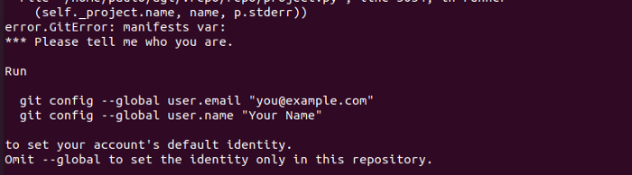

# agl-playground

## Overview

Setup PVE Container with docker inside it and then build agl inside the docker container

### Prep PVE container with docker

On PVE

```
pveam download local ubuntu-21.04-standard_21.04-1_amd64.tar.gz
```

Create container as unprivedged

In the container, run the following:
```
apt-get update && \
  apt install curl gnupg2 -y && \
  curl -fsSL https://download.docker.com/linux/ubuntu/gpg | apt-key add - && \
  echo 'deb [arch=amd64] https://download.docker.com/linux/ubuntu hirsute stable' >> /etc/apt/sources.list && \
  apt-get update && \
  apt-get install docker-ce -y && \
  apt upgrade -y && \
  useradd -m -s /bin/bash build && \
  usermod -a -G sudo build && \
  usermod -a -G docker build && \
  shutdown -h now
```
Note the VMID of your container. Then, on your Proxmox host, run the following:
```
VMID=113 # Replace this with the VMID of your container
echo 'features:  keyctl=1,nesting=1' | tee -a "/etc/pve/local/lxc/${VMID}.conf"
```

When you start your container again, you should be able to successfully run the following command:
```
su - build
docker run hello-world
```


### Running your Yocto Build on Docker
So, now that we’ve got that out of the way, I’ve written a Dockerfile to speed up the process. I’ve brewed this from scratch and it may not be yet fully optimized as I am fairly new to docker.
Now, to build the image, making adjustments to your git username and e-mail:
```
mkdir ~/aaos && cd ~/aaos
docker build \
--target fetch \
--build-arg USER_NAME=$USER \
--build-arg HOST_UID=`id -u` \
--build-arg HOST_GID=`id -g` \
--build-arg GIT_USER_NAME=yourUserName \
--build-arg GIT_EMAIL=your@Email.com \
-t matt/aaos:latest .
```
Failing to adjust your Git credentials might implicate in the following error message:

Common issue if you miss setting up git user.
Next, run the container:
```
rm -rf out
mkdir out
sudo docker run -it \
-v $PWD/out:/home/$USER/agl \
agl:latest
```
At this point, you are inside the running docker. Next up, run the Yocto Build:
```
./../bin/repo init -b koi -u https://gerrit.automotivelinux.org/gerrit/AGL/AGL-repo
./../bin/repo sync
source meta-agl/scripts/aglsetup.sh -m raspberrypi4 agl-demo agl-appfw-smack
bitbake agl-demo-platform
```
And then go grab a cup of coffee. Hell, order a pizza, eat it, sleep on it. Watch the original Lord of the Rings trilogy. You have plenty of time and, hopefully, very little processor slack :)
After the long winter, you should have on the ~/agl/out/build/tmp/deploy/images/raspberrypi4–64 folder the build result:

Part of the resulting tree from the AGL build.

## Flashing the Raspberry Pi 4
Finally, flashing time. Plug-in your sd-card and figure out what is its path on your /dev folder. You can run lsblk and find what is your sd-card’s entry on /dev. Here is an example from my system:

Sample output from lsblk
In this example, I have a 4 GiB sd-card with a single partition. /dev/sda is the disk’s path and /dev/sda1 is its partition. When issuing the following command, you should refer to your disk, not to its partition, i.e., /dev/sda . Also, bear in mind that your image name may be somewhat different.
From a terminal, navigate to ~/agl/out/build/tmp/deploy/images/raspberrypi4–64. There, you will find a flashable image, a wic file compressed with xz. To flash your new image, run:
```
xzcat {yourimagename}.wic.xz| sudo dd of=/dev/{your-sd-disk} bs=4M status=progress
sync
```
Taking into operation
Insert the sd-card on your target and power up. The first boot should take a little longer — here, it took a little less than a minute. The next time, a little over 10 seconds after the kernel was loaded — therefore, a little more, overall, considering bootloader and its usual three seconds to go into U-Boot, kernel loading, and initial system setup.

Automotive Grade Linux clumsily running on the single screen I have at the time: a 29" monitor.


## Conclusion
While Automotive Grade Linux might not be a fit candidate for the first contact with embedded Linux, it definitely packs many goods for a competitive, heated, industry segment such as the automotive industry, being a relevant framework.
Being an open-source project, it suffers from a very common issue among its peers: the project (and code, its dependencies, and so on) evolves, whereas documentation not so much, especially when it comes to tutorial approaches, such as the one I tried to bring you.
I hope it helps you :)
